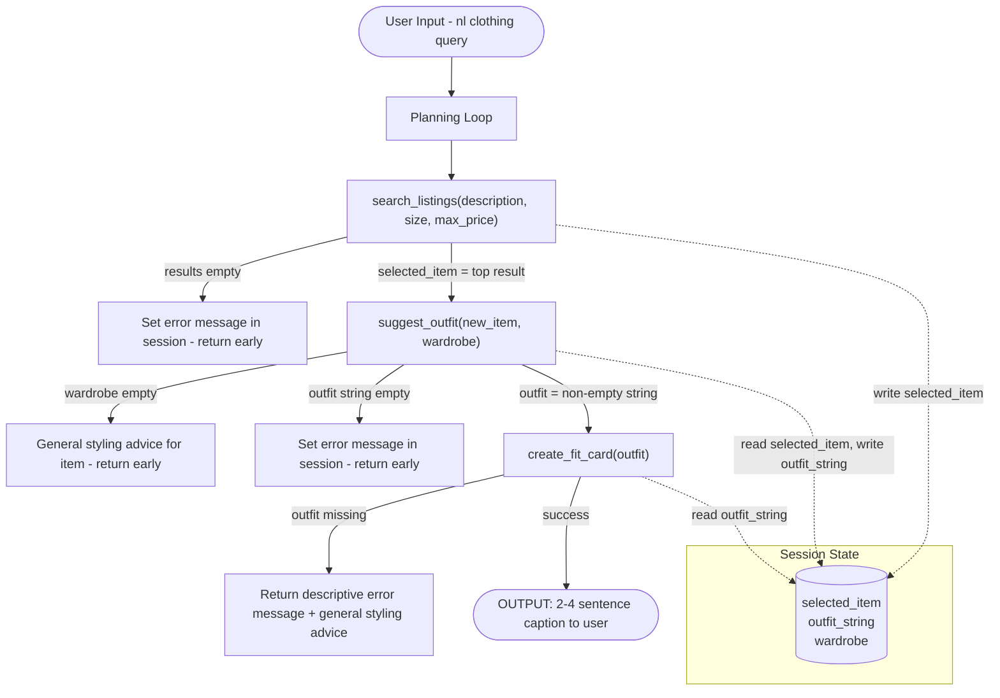

# FitFindr — planning.md

> Complete this document before writing any implementation code.
> Your spec and agent diagram are what you'll use to direct AI tools (Claude, Copilot, etc.) to generate your implementation — the more specific they are, the more useful the generated code will be.
> Your planning.md will be reviewed as part of your submission.
> Update it before starting any stretch features.

---

## Tools

List every tool your agent will use. For each tool, fill in all four fields.
You must have at least 3 tools. The three required tools are listed — add any additional tools below them.

### Tool 1: search_listings

**What it does:**
<!-- Describe what this tool does in 1–2 sentences -->
This tool searches the mock listings dataset for items matching the description, optional size, and optional price ceiling.

**Input parameters:**
<!-- List each parameter, its type, and what it represents -->
- `description` (str): a description of the item of clothing that the user is looking for
- `size` (str): size to filter by or None skip size filtering. matching should be case-insensitive
- `max_price` (float): the maximum price that the user is willing to pay or None to skip price filtering

**What it returns:**
<!-- Describe the return value — what fields does a result contain? -->
It should return a list of dicts sorted by relevant with best match first. If nothing matches, then it should returnan empty list

**What happens if it fails or returns nothing:**
<!-- What should the agent do if no listings match? -->
If no listings match, stop the loop and tell the user that no listings match the given criteria for the specified item of clothing

---

### Tool 2: suggest_outfit

**What it does:**
<!-- Describe what this tool does in 1–2 sentences -->
This tool 1-2 complete outfits given the user's wardrobe with the returned item(s) of clothing. Given what was returned from search_listings, it should compare what's in the user's wardrobe with the returned item(s) and suggest outfits to go together.

**Input parameters:**
<!-- List each parameter, its type, and what it represents -->
- `new_item` (dict): the item the user is considering buying
- `wardrobe` (dict): a wardrobe dict with an 'items' key containings a list of wardrobe item dicts

**What it returns:**
<!-- Describe the return value -->
A non-empty string ith outfit suggestions

**What happens if it fails or returns nothing:**
<!-- What should the agent do if the wardrobe is empty or no outfit can be suggested? -->
If the wardrobe is empty o no outfit can be suggested, stop the loop but also offer general styling advice for the item rather than raising an exception or returning an empty string

---

### Tool 3: create_fit_card

**What it does:**
<!-- Describe what this tool does in 1–2 sentences -->
This tool should generate a short, shareable outfit caption for the thrifted find.

**Input parameters:**
<!-- List each parameter, its type, and what it represents -->
- `outfit` (string): The outfit suggested string from suggest_outfit()
- `new_item` (dict): The listing dict for the thrifted item.

**What it returns:**
<!-- Describe the return value -->
A 2–4 sentence string usable as an Instagram/TikTok caption.

**What happens if it fails or returns nothing:**
<!-- What should the agent do if the outfit data is incomplete? -->
If outfit is empty or missing, tell the user that there were no viable outfits found, but give general stylling advice based on the natural languge that the user first inputted.

---

### Additional Tools (if any)

<!-- Copy the block above for any tools beyond the required three -->

---

## Planning Loop

**How does your agent decide which tool to call next?**
<!-- Describe the logic your planning loop uses. What does it look at? What conditions change its behavior? How does it know when it's done? -->
After search_listings runs, check if results is empty. If yes, set an error message in the session and return early. If no, set selected_item = results[0] and proceed to the next tool, suggest_outfit. After suggest_outfit runs, check if results is empty. If the wardrobe is empty, return early but offer general styling advice for the item rather than raising an exception or returning an empty string. If the wardrobe isn't empty, expect a non-empty string with outfit suggestions and set suggest_outfit[0] and proceed to the next tool, create_fit_card. If for some reason, suggest_outfit has an empty, whitespace-only outfit string, or is missing, return early and set and error message indicating that no outfit was found. If not, return a 2-4 sentence string usable as an Instagram/TikTok caption. 

---

## State Management

**How does information from one tool get passed to the next?**
<!-- Describe how your agent stores and accesses state within a session. What data is tracked? How is it passed between tool calls? -->
The agent should have an understanding of what parameters the tools are expecting, as well as a set cadence given a prompt. For this project, the only prompts that the user should input is descriptive context on what kind of item of clothing they're looking for in a vintage store. The agent should then follow the following cadence of tools for each suggested item of clothing that the user provided that they're looking for:
search_listings -> suggest_outfit -> create_fit_card

Given this cadence, the tool should use outputs from the previous tool as parameters/a parameter for calling the next tool.

---

## Error Handling

For each tool, describe the specific failure mode you're handling and what the agent does in response.

| Tool | Failure mode | Agent response |
|------|-------------|----------------|
| search_listings | No results match the query | set an error message in the session and return early - do NOT raise an exception |
| suggest_outfit | Wardrobe is empty | offer general styling advice for the item rather than raising an exception or returning an empty string |
| create_fit_card | Outfit input is missing or incomplete | return a descriptive error message string - do NOT raise an exception |

---

## Architecture

---

## AI Tool Plan

<!-- For each part of the implementation below, describe:
     - Which AI tool you plan to use (Claude, Copilot, ChatGPT, etc.)
     - What you'll give it as input (which sections of this planning.md, your agent diagram)
     - What you expect it to produce
     - How you'll verify the output matches your spec before moving on

     "I'll use AI to help me code" is not a plan.
     "I'll give Claude my Tool 1 spec (inputs, return value, failure mode) and ask it to implement
     search_listings() using load_listings() from the data loader — then test it against 3 queries
     before trusting it" is a plan. -->

**Milestone 3 — Individual tool implementations:**

**Tool 1: search_listings()**
- AI tool: Claude
- Input: Tool 1 spec (description, size, max_price params; return value; failure mode from planning.md), reference to load_listings() data loader from tools.py
- Expected output: Python function that queries mock listings dataset, filters by description/size/price, returns sorted list of dicts that match the user's description
- Verification: Test against 3 sample queries (e.g. "vintage tee under $30", "large leather jacket", "red sneakers"), verify results match dataset and are sorted by relevance

**Tool 2: suggest_outfit()**
- AI tool: Claude
- Input: Tool 2 spec (new_item and wardrobe params; outfit string return value; failure modes), sample wardrobe structure from dataset
- Expected output: Python function that takes new clothing item + user wardrobe, suggests 1-2 complete outfits or gives general styling advice if wardrobe empty
- Verification: Test with empty wardrobe (should return styling advice), test with populated wardrobe (should return outfit combinations), verify output is non-empty string

**Tool 3: create_fit_card()**
- AI tool: Claude
- Input: Tool 3 spec (outfit string input; Instagram/TikTok caption output; failure modes), sample outfit descriptions from suggest_outfit
- Expected output: Python function that generates 2-4 sentence shareable caption, includes fallback general styling advice if outfit data missing
- Verification: Test with valid outfit string (should produce caption), test with empty/None input (should return error + general advice), verify caption length and tone match Instagram standards

**Milestone 4 — Query parsing:**

**Query Parser**
- AI tool: Claude
- Input: Example queries from complete interaction ("vintage graphic tee under $30", "designer ballgown size XXS under $5"), description of expected parsed output (description, size, max_price fields)
- Expected output: Function that parses natural language query string into structured parameters (description, size, max_price). Choose parsing approach: regex patterns, string matching, or language model extraction
- Verification: Test against 5+ queries with and without optional fields (size, price), verify correct extraction and graceful handling when optional fields omitted

**Milestone 4 — Planning loop and state management:**

**Planning Loop + State Management**
- AI tool: Claude
- Input: Architecture flowchart, all three tool specs, _new_session structure (showing available session fields), error handling table, complete interaction example walkthrough
- Expected output: Main agent function that manages session lifecycle: initialize session dict, parse query, call search_listings and check for no-results error path, select best result, call suggest_outfit and handle empty-wardrobe fallback, call create_fit_card with error handling, return completed session
- Verification: Run happy path with example query and populated wardrobe, confirm all three tools called in sequence with correct input/output passing. Test error paths: no search results (early return), empty wardrobe (styling advice fallback), incomplete outfit data (error + fallback). Verify session dict properly tracks state at each milestone

---

## A Complete Interaction (Step by Step)

**What is this project?:** This project is called FitFindr. It is a multi-tool AI agent that helps users find secondhand pieces and figure out how to wear them. We will use a set of tools in response to a natural language request by searching listings, evaluating fit against an existing wardrobe, and generating a shareable outfit description.

Write out what a full user interaction looks like from start to finish — tool call by tool call. Use a specific example query.

**Example user query:** "I'm looking for a vintage graphic tee under $30. I mostly wear baggy jeans and chunky sneakers. What's out there and how would I style it?"

**Step 1:**
<!-- What does the agent do first? Which tool is called? With what input? -->
Agent parses query and calls `search_listings(description="vintage graphic tee", size=None, max_price=30.0)`. Returns list of matching tees sorted by relevance. Stores `selected_item = results[0]` (e.g. {"id": 42, "name": "Faded Nirvana Tee", "size": "M", "price": 22.99, ...}) in session state.

**Step 2:**
<!-- What happens next? What was returned from step 1? What tool is called now? -->
Agent loads user wardrobe from session ({"items": [{"type": "jeans", "style": "baggy", "color": "blue"}, {"type": "sneakers", "style": "chunky", "color": "white"}]}) and calls `suggest_outfit(new_item=selected_item, wardrobe=wardrobe)`. Returns outfit string like "Pair the oversized Nirvana tee with your baggy blue jeans and white chunky sneakers for a 90s-inspired fit..." Stores `outfit_string = result` in session state.

**Step 3:**
<!-- Continue until the full interaction is complete -->
Agent calls `create_fit_card(outfit=outfit_string)`. Returns Instagram/TikTok caption like "Thrifted vibes ✓ Baggy jeans ✓ Chunky kicks ✓ Feeling 90s aesthetic. Oversized band tees never go out of style—pair with your favorite baggy denim and platform sneakers for instant cool-girl energy."

**Final output to user:**
<!-- What does the user actually see at the end? -->
*"Thrifted vibes ✓ Baggy jeans ✓ Chunky kicks ✓ Feeling 90s aesthetic. Oversized band tees never go out of style—pair with your favorite baggy denim and platform sneakers for instant cool-girl energy."*